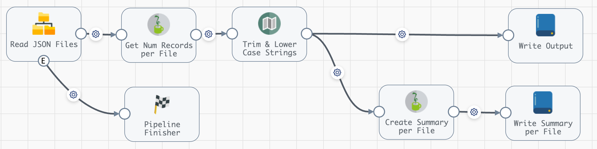
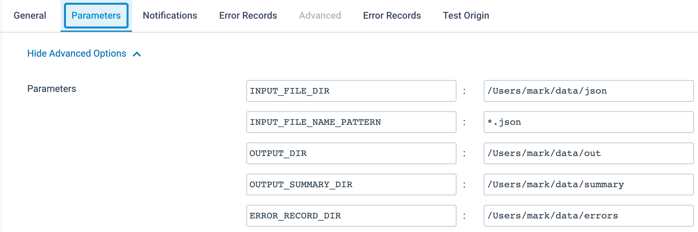
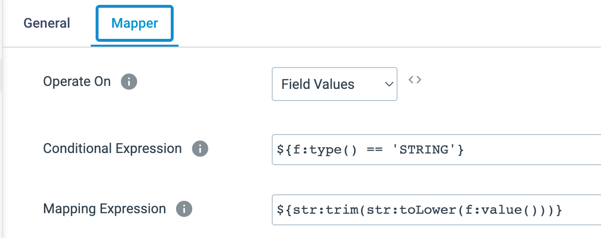

## StreamSets Example - SDC - Aggregations-Per-Input-File
This project provides an example of how to perform aggregations on input data on a per-file basis using [Data Collector](https://streamsets.com/products/data-collector-engine/) (SDC). 

Typically, one would perform aggregations using [Transformer for Spark](https://streamsets.com/products/transformer-etl-engine/) or [Transformer for Snowflake](https://streamsets.com/products/transformer-snowflake/), but if one wants to compute aggregations using SDC, the technique provided in this example can be used in SDC without blowing up memory.

Tested in [StreamSets Platform](https://streamsets.com/products/) using SDC v5.6.0

### The challenge

It is easy enough to use the "file" record attribute to detect when records from a given file are being read, and to detect when the file attribute has changed. However, this risks missing when the last record of the last file has been read, as there may not be subsequent records in the pipeline to trigger the aggregate calculations for the last file.

This example uses a Jython processor to count the number of lines of each file when processing the first record of each file, which allows the pipeline to know when it is processing the last record of each file, without relying on subsequent records.  Records for any given file can be spread across batches, and the pipeline correctly accumulates the metrics per file.

### The example pipeline

The example uses JSON data extracted from the [New York Taxi Dataset](https://www.nyc.gov/site/tlc/about/tlc-trip-record-data.page). I have included a few JSON files to test the pipeline with [here](input-data/).

The pipeline looks like this:



The pipeline reads a set of JSON files, lower cases and trims String fields, and writes records to an output directory.  The pipeline also writes one summary record per input file that includes these summary aggregations per input file:

 - the sum of the <code>fare_amount</code> field
 - the average of the <code>trip_distance</code> field
 - the sum of the <code>total_amount</code> field grouped by the <code>payment_type</code> field


### Import the pipeline

You can download the pipeline archive from [here](pipelines/) and import it into your StreamSets environment as described [here](https://docs.streamsets.com/portal/platform-controlhub/controlhub/UserGuide/ExportImport/Importing.html#task_qr5_szm_qx)

### Set pipeline parameters

The pipeline requires several parameters to be set. Here are the settings from my environment:



Set the pipeline parameters to the appropriate values in your environment and make sure all directories specified exist in advance.

### Run the pipeline
When you run the pipeline with the example data provided you should see:

-  2,025 records were read (two of the  input files have 1000 records each and one of input files has only 25 records)

- 2025 records were written to the output dir, with all String fields lower cased and trimmed.

- 3 records were written to the summary output dir, with data that looks like this for each input record:

```
{
  "timestamp": "2023-09-16 15:40:09",
  "file_name": "/Users/mark/data/json/2.json",
  "record_count": 1000,
  "sum_fare_amount": 18894.55,
  "avg_trip_distance": 3.32,
  "total_amount_group_by_payment_type": {
    "payment_type_4": 29,
    "payment_type_2": 4014.85,
    "payment_type_3": 64.33,
    "payment_type_1": 25588.84
  }
}
```
### Implementation details

- The <code> Trim & Lower Case Strings</code> stage is a [Field Mapper](https://docs.streamsets.com/portal/platform-datacollector/latest/datacollector/UserGuide/Processors/FieldMapper.html#concept_q5y_tdq_xgb) configured liks this:



- The <code>Get Num Records per File</code> stage is a [Jython Evaluator](https://docs.streamsets.com/portal/platform-datacollector/latest/datacollector/UserGuide/Processors/Jython.html#concept_a1h_lkf_lr) that determines how may records are in each input files, and then sets these record attributes <code>is_first_record_in_file</code> and <code>is_last_record_in_file</code>

- The <code>Create File Summary</code> stage is another Jython Evaluator that aggregates values for each record, and on the last record for each file it creates and writes a file summary record.


 
