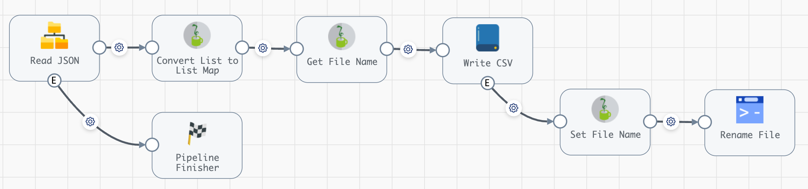
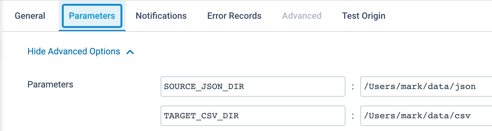
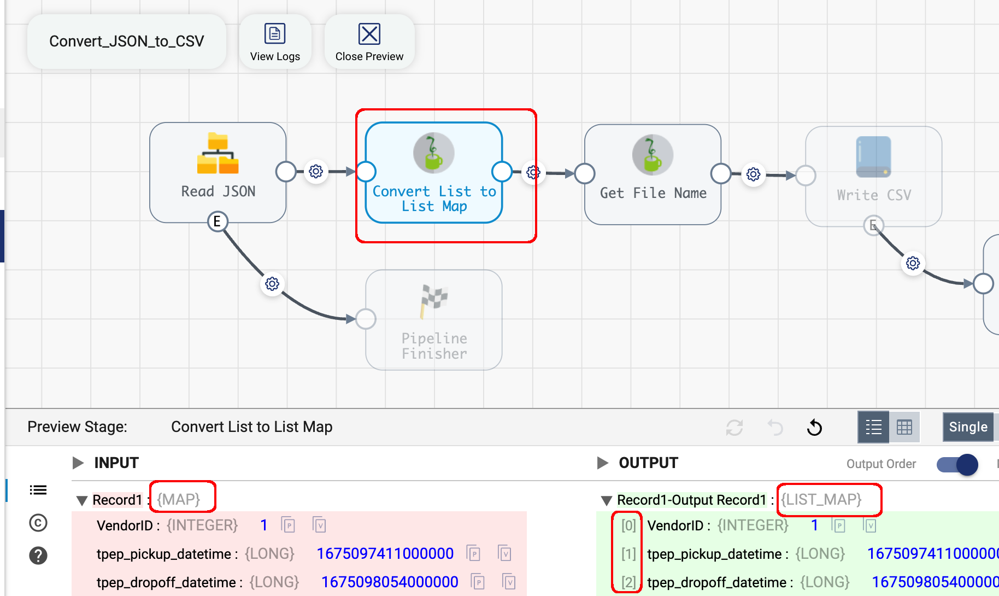

## StreamSets Example - SDC - Convert JSON to CSV
This project provides an example of how to convert JSON files to CSV files using [Data Collector](https://streamsets.com/products/data-collector-engine/) (SDC), while preserving  fils names and record-to-file mapping.

For example, given input files like this:

```
file_1.json with 96 records
file_2.json with 1000 records
file_3.json with 25 records
```

the desired output is:

```
file_1.csv with 96 records
file_2.csv with 1000 records
file_3.csv with 25 records
```

It is assumed that all records within each JSON file adhere to the same schema, in order to have consistent CSV files. 


### The challenge

SDC's [Local FS](https://docs.streamsets.com/portal/platform-datacollector/5.6.x/datacollector/UserGuide/Destinations/LocalFS.html#concept_zvc_bv5_1r) destination allows users to specify prefixes and suffixes for generated files, but not explicit file names.  One can hook the [file-closed event](https://docs.streamsets.com/portal/platform-datacollector/5.6.x/datacollector/UserGuide/Destinations/LocalFS.html#concept_tyc_scc_rx) to trigger a [Shell Executor](https://docs.streamsets.com/portal/platform-datacollector/latest/datacollector/UserGuide/Executors/Shell.html#concept_jsr_zpw_tz) to rename files once closed, but the file-closed event does not include the source file name, so the challenge is: how can one access source file names when renaming generated files? 

### The example pipeline

The example pipeline that accomplishes this goal looks like this:



The pipeline reads a set of JSON files and generates CSV files with matching file names and record-to-file mappings.


### Import the pipeline

You can download the pipeline archive from [here](pipelines/) and import it into your StreamSets environment as described [here](https://docs.streamsets.com/portal/platform-controlhub/controlhub/UserGuide/ExportImport/Importing.html#task_qr5_szm_qx)

### Set pipeline parameters

The pipeline requires parameters to be set to specify the source JSON directory and the target CSV directory. Here are the settings from my environment:



Set the pipeline parameters to the appropriate values in your environment and make sure both directories specified exist in advance.

### Run the pipeline
When you run the pipeline with the example data provided you should see:

-  1,121 records were read from the three sample files:

```
file_1.json with 96 records
file_2.json with 1000 records
file_3.json with 25 records
```

- 1,121 records were written to three files in the target dir:

```
file_1.csv with 96 records
file_2.csv with 1000 records
file_3.csv with 25 records
```

### Implementation details

CSV files requires records to be in List-Map format with field ordering;  however, JSON records are in Map format as JSON records are un-ordered sets of name/value pairs. The pipeline uses a simple Jython script to convert Map records to a List-Map records:
```
for record in sdc.records:
  try:
    map = record.value
    record.value = sdc.createMap(True)
    for key in  map.keys():
      record.value[key] = map[key]
    sdc.output.write(record)
  except Exception as e:
    sdc.error.write(record, str(e))
```

We can view the results in Preview mode:



The pipeline uses source file names as temporary directory names for output files as a way to make source file names available to the Shell Executor. 

See the pipeline's Jython stages' scripts and the Shell Executor script for details. 


 
